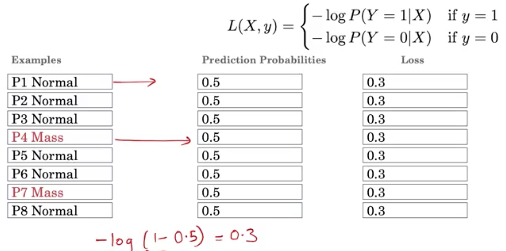

# AI for Medical Diagnosis
-
---
## Handling Class Imbalance and Small Training Sets
### Building and Training a Model for Medical Diagnosis

Building an algorithm to identify whether an X-Ray image has a mass or not  

 

---
## Train, prediction & loss
Algorithm has many different names:
 

 

 

 

---
### Image Classification and Class Imbalance
3 key challenges of image classification:

Class Imbalance:
* In real life, there is not equal samples of normal and disease in the dataset
* There are a lot more examples of normals than of mass, especially if we're looking at X-rays of a healthy population.
* In a medical dataset, you might see 100 times as many normal examples as mass examples.

 ---
### Binary Cross Entropy Loss Function

---
### Resampling to Achieve Balanced Classes

---
### Multi-Task
